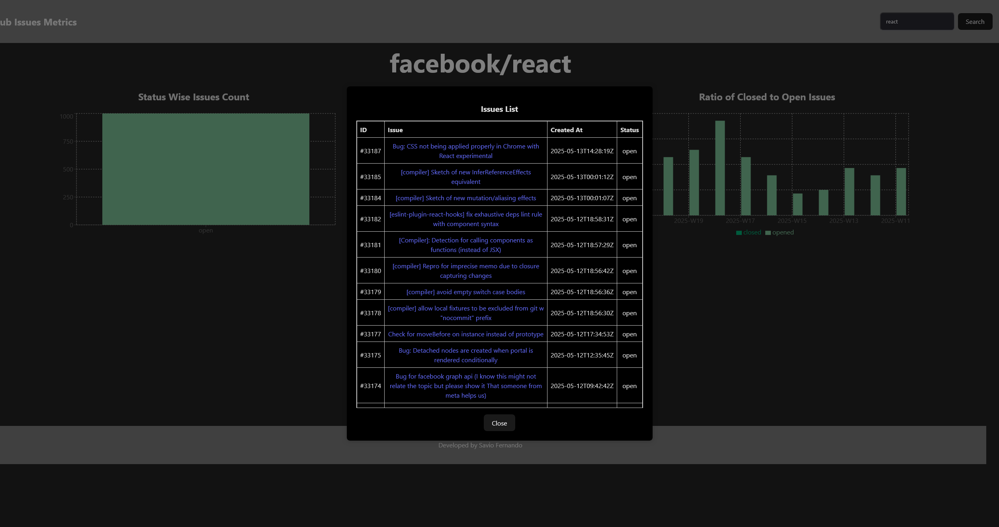
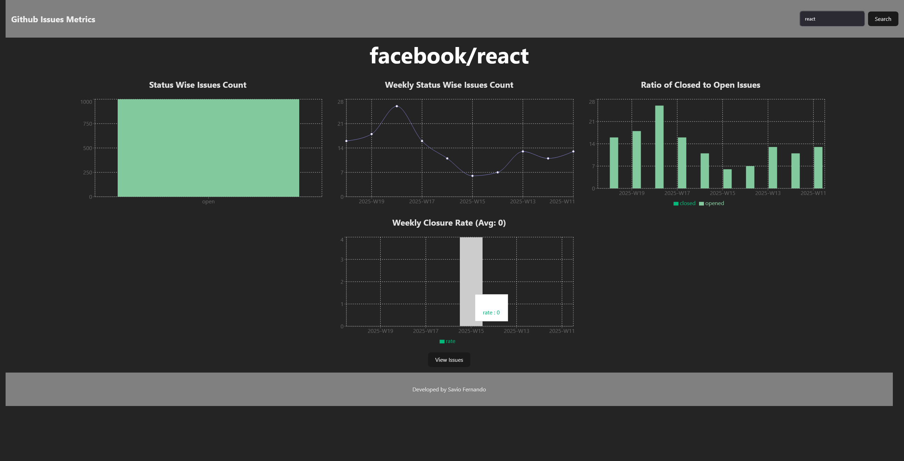
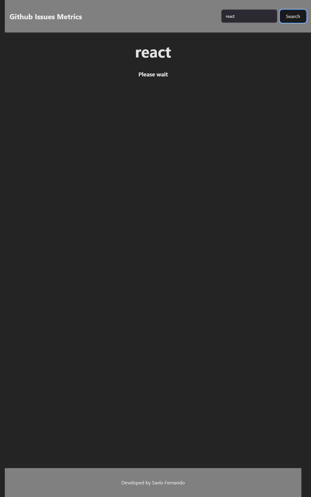
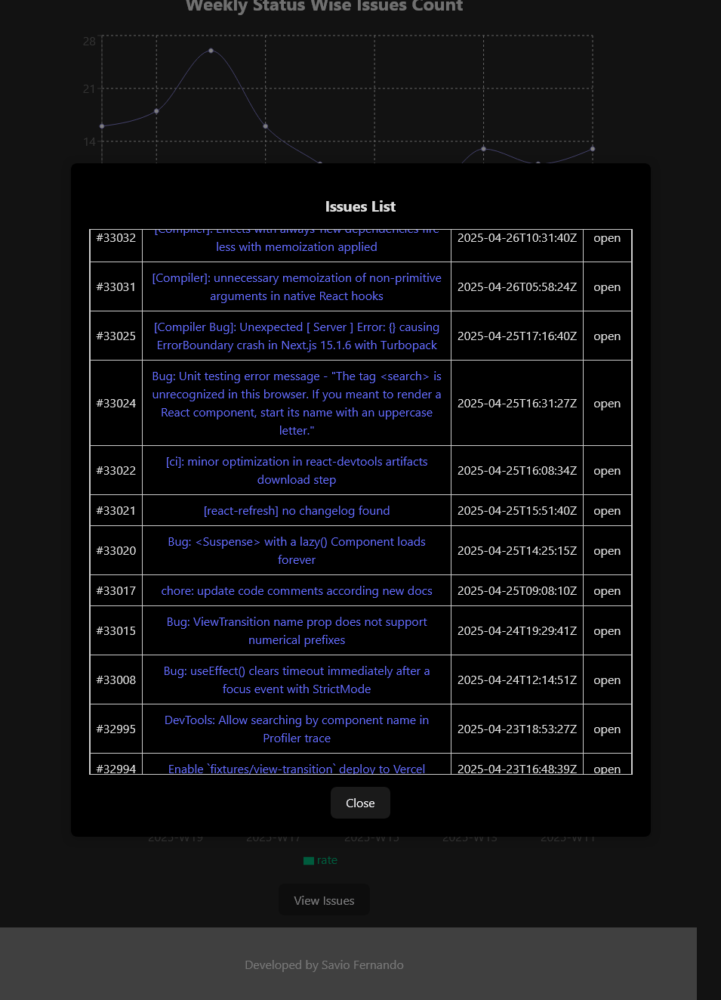
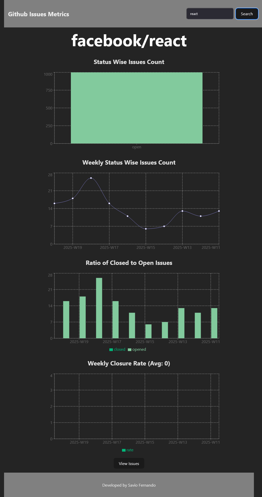

# Kennect GitHub Issues Dashboard

A React + Vite application to visualize GitHub Issues data for public repositories using charts and tables.

## Features

- Search any public GitHub repository by name
- Fetch and paginate up to 1000 issues using GitHub REST API
- Display:
  - Open vs Closed issue counts
  - Weekly trends
  - Closure rates (% closed per week)
- Visualized using **Recharts** (bar, pie, line charts)
- Built with Vite, React, and modern JS

## Demo Screenshots










## Setup Instructions

### 1. Clone the repository

```bash
git clone https://github.com/your-username/github-issues-dashboard.git
cd github-issues-dashboard
````

### 2. Install dependencies

```bash
npm install
```

### 3. Configure `.env`

Create a `.env` file in the root and add your **GitHub token** (optional but recommended to avoid rate limits):

```env
GITHUB_PERSONAL_ACCESS_TOKEN=your_personal_access_token
```

> ✅ You can use a **fine-grained** or **classic** GitHub token — public repo access is sufficient.

### 4. Run the development server

```bash
npm run dev
```

Open [http://localhost:5173](http://localhost:5173) in your browser.

##  Build for Production

```bash
npm run build
```

## Environment Variables

| Variable            | Purpose                              |
| ------------------- | ------------------------------------ |
| `GITHUB_PERSONAL_ACCESS_TOKEN` | (Optional) Auth token for GitHub API |

## Stack

* [React](https://react.dev/)
* [Vite](https://vitejs.dev/)
* [Recharts](https://recharts.org/)
* [GitHub REST API](https://docs.github.com/en/rest/issues)


## License

The Unlicensed


